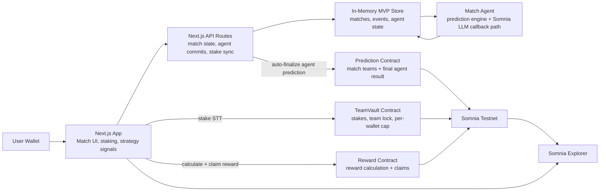

# WorldCup Civil

WorldCup Civil is an autonomous football prediction economy built on Somnia Testnet.

Users stake testnet STT on a team, submit capped supporter strategy signals, and watch a Match Agent update its prediction as match events arrive. In production, those events would come from real-world live football data feeds; in this MVP, a simulated event stream is used for reliable demo execution. When the match ends, rewards are settled by the agent's final locked prediction and claimed through on-chain contracts with explorer-verifiable transactions.

## Why It Matters

Most prediction markets depend on an external oracle result and treat users as passive bettors. WorldCup Civil explores a different model:

- A live autonomous agent analyzes match context.
- Real-world match events and supporter strategy signals are both capped inputs to the agent.
- Supporters can influence the agent through stake-weighted strategy signals.
- The agent keeps final authority, so the market is not a pure popularity contest.
- Settlement and reward claims happen on Somnia Testnet.

The MVP demonstrates how fast, low-cost EVM execution can support agent-driven consumer experiences where user intent, AI reasoning, and on-chain settlement all interact in one flow.

## Core Features

- Wallet connection through RainbowKit and Wagmi.
- Somnia Testnet staking with a hard on-chain cap of `0.01 STT` per wallet per match.
- One-team-per-match rule enforced by `TeamVault`.
- Production target: real-world live match events such as goals, cards, substitutions, possession shifts, and clock updates.
- MVP event stream: simulated match events for repeatable judging and demo reliability.
- Match Agent prediction updates from capped match-event impact and capped supporter signals.
- Final reward settlement based on the agent's last locked prediction, not the simulated final score.
- Automatic on-chain finalization after match completion.
- Claimable rewards through the `Reward` contract.
- Explorer links for stake, finalize, and claim transactions.

## Architecture



## On-Chain Contracts

### `TeamVault`

Records user stakes by `matchId` and `teamId`.

- Enforces one team per wallet per match.
- Enforces max `0.01 STT` per wallet per match.
- Tracks total pool size per team.

### `Prediction`

Stores the finalized agent settlement result.

- The server-side agent wallet is authorized as oracle.
- Match teams are registered before finalization.
- Finalization records home score, away score, winner, and finalized state.

### `Reward`

Calculates and pays claimable rewards.

- Draws return original stake only.
- Winning supporters keep their stake.
- If there is an opposing pool, 80% of the losing pool is redistributed pro-rata to winning supporters.
- If MVP liquidity is one-sided, the prefunded Reward contract pays a sponsor bonus so winning users still receive a meaningful reward.
- Claim state is stored on-chain to prevent double claims.

### `AgentCallback`

Callback contract for the Somnia LLM agent integration path.

- Requests inference from Somnia's agent platform.
- Stores returned text and raw callback metadata.
- Used as the on-chain bridge for agent-response experiments.

## Settlement Rule

Rewards are settled by the Match Agent's last locked prediction, not by the simulated full-time score.

This is intentional. Match events are treated as capped inputs to the agent rather than direct settlement commands. The simulated full-time result is displayed as match context, while the prediction economy settles according to the autonomous agent's final view before the final whistle can overwrite settlement. The full-time event does not trigger a new Somnia LLM prediction and cannot overwrite settlement after the final whistle.

## MVP Funding Model

This MVP uses a prefunded `Reward` contract for deterministic testnet payouts and sponsor bonuses. User stakes are recorded in `TeamVault`, while claimable settlement rewards are paid by the `Reward` contract.

For demo safety, each wallet is capped at `0.01 STT` per match on-chain. With a `0.3 STT` prefunded reward pool, the demo comfortably supports small hackathon test flows and still provides sponsor bonuses when early liquidity is one-sided.

In production, reward liquidity should become closed-loop:

1. Users stake into an escrow contract.
2. The match result is finalized by the authorized agent flow.
3. The settlement contract allocates the winning and losing pools directly.
4. Winners claim original stake plus the configured share of the losing pool.
5. Draws return stake to both sides.

## Tech Stack

- Next.js 14
- React 18
- Tailwind CSS
- RainbowKit
- Wagmi
- Viem
- Solidity
- Hardhat
- Somnia Testnet

## Local Setup

Install dependencies:

```bash
npm install
```

Create `.env.local`:

```bash
PRIVATE_KEY=your_server_wallet_private_key
NEXT_PUBLIC_VAULT_ADDRESS=...
NEXT_PUBLIC_PREDICTION_ADDRESS=...
NEXT_PUBLIC_REWARD_ADDRESS=...
NEXT_PUBLIC_CALLBACK_ADDRESS=...
```

Compile contracts:

```bash
npx hardhat compile
```

Deploy to Somnia Testnet:

```bash
npx hardhat run scripts/deploy.ts --network somnia_testnet
```

add the generated address to the `.env.local` file

Run the app:

```bash
npm run dev
```

Open:

```txt
http://localhost:3000
```

Somnia faucet:

```txt
https://cloud.google.com/application/web3/faucet/somnia/shannon
```

## Current MVP Limitations

- Match events are simulated for demo reliability; production would connect real-world live football data feeds.
- Reward pool is prefunded instead of fully escrow-based.
- Store is in-memory and intended for hackathon demo flows.
- The agent logic is deterministic plus Somnia LLM callback experimentation, not a production sports model.

## Future Work

- Move from prefunded rewards to fully escrowed settlement.
- Add persistent database storage.
- Add more matches and richer event feeds.
- Add deeper Somnia LLM evaluation and multi-agent comparison.
- Add public dashboards for agent decisions, settlement history, and contract balances.
